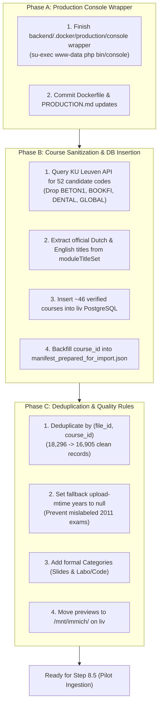

# Action Plan: Production Hardening, Course Sanitization & Manifest Finalization

This document outlines the exact execution plan for completing the three prerequisite tasks before initiating pilot testing and document ingestion.

---

## Architecture & Workflows

---

## Phase A: Production Console Wrapper & Documentation

### Goal
Prevent root file-permission pollution on `/app/var/cache/prod` during Symfony console operations on `liv`.

### Steps
1. **Verify wrapper**: `backend/.docker/production/console` executes `su-exec www-data php /app/bin/console "$@"`.
2. **Verify Dockerfile**: `RUN apk add --no-cache su-exec` and `COPY .docker/production/console /usr/local/bin/console`.
3. **Verify PRODUCTION.md**: Replaces `exec -T backend php bin/console` with `exec -T backend console` throughout documentation.
4. **Git Commit**: Commit production container hardening changes (`feat(docker): add non-root console wrapper for production`).

---

## Phase B: Course Sanitization & PostgreSQL Ingestion

### Goal
Eliminate `course_id: null` on 1,219 records by inserting official KU Leuven courses and dropping junk folder strings.

### Steps
1. **Sanitize Candidate Codes**:
   - Filter out invalid regex matches: `BETON1`, `BOOKFI`, `DENTAL`, `GLOBAL`.
2. **Fetch Official Titles via KU Leuven OpenSearch API**:
   - Endpoint: `https://dataservice.kuleuven.be/opo/_search`
   - Extract `name_nl` and `name_en` from `moduleLanguageSet.moduleTitleSet`.
   - Examples of resolved titles:
     - `H01T4A` $\rightarrow$ Ontwerp van elektronische producten / Design of Electronic Products
     - `H01B8A` $\rightarrow$ Warmte-overdracht / Heat Transfer
     - `H01M0A` $\rightarrow$ Vermogenselektronica / Power Electronics
     - `H04V3A` $\rightarrow$ Additive Manufacturing
     - `H03F0A` $\rightarrow$ Optimalisatie / Optimization
     - `H03G0A` $\rightarrow$ Bio-ethiek / Bioethics
3. **Insert into Production PostgreSQL on `liv`**:
   - Run SQL script inserting the ~46 courses into `course` table.
4. **Backfill `course_id` into Manifest**:
   - Re-map the 1,219 records so **0 records have `course_id: null`**.

---

## Phase C: Deduplication & Data Quality Finalization

### Goal
Ensure high-quality, student-facing data with zero duplicates and accurate year indicators.

### Steps
1. **Deduplicate on `(file_id, course_id)`**:
   - Drops ~1,167 redundant duplicate uploads within the same course.
   - Preserves 170 legitimate multi-course shares.
   - Target manifest count: **16,905 clean documents**.
2. **Sanitize Academic Year Fallbacks**:
   - For records where `year_source == 'mtime'`, set `year = null`.
   - Leaves high/medium confidence years (`2017 - 2018`, `2023 - 2024`) intact.
3. **Add Standard Categories**:
   - Insert categories `Slides / Lesmateriaal` and `Labo & Code` into `document_category` (IDs 6 & 7) to cleanly map ~6,000 files without awkward force-fitting.
4. **Move Previews to Permanent Staging**:
   - Move `/tmp/manifest_with_content_previews.jsonl` to `/mnt/immich/burgieclan-staging/manifest_with_content_previews.jsonl` on `liv`.

---

## Execution Checklist

- [ ] **Phase A**: Commit `console` wrapper, Dockerfile, and `PRODUCTION.md`
- [ ] **Phase B.1**: Run course resolution script against KU Leuven API
- [ ] **Phase B.2**: Insert sanitized courses into PostgreSQL on `liv`
- [ ] **Phase B.3**: Backfill `course_id` for all 1,219 records
- [ ] **Phase C.1**: Apply `(file_id, course_id)` deduplication (16,905 records)
- [ ] **Phase C.2**: Set upload-mtime fallback years to `null`
- [ ] **Phase C.3**: Insert `Slides / Lesmateriaal` and `Labo & Code` categories
- [ ] **Phase C.4**: Move content preview manifest to `/mnt/immich/` on `liv`
