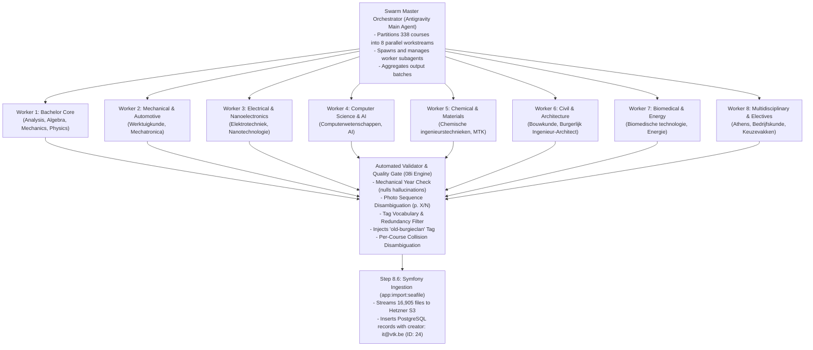

# AI Swarm Execution Plan: Multi-Agent Course Normalization

This plan specifies the parallel multi-agent architecture to normalize, tag, and validate all **16,905 documents across 338 courses** for VTK Burgieclan.

---

## 1. Multi-Agent Hierarchy & Roles



---

## 2. Workstream Partitioning (8 Parallel Worker Subagents)

| Worker ID | Target Engineering Cluster | Course Count | Est. Docs | Workstream Focus |
| :--- | :--- | :---: | :---: | :--- |
| **Worker 1** | **Bachelor Core** | ~35 | ~3,500 | Analysis, Algebra, Mechanics I/II, Physics, Chemistry, P&O 1/2 |
| **Worker 2** | **Mechanical & Aero (WTK)** | ~45 | ~2,500 | Applied Mechanics 3, Thermodynamics, Machine Design, Fluid Mechanics |
| **Worker 3** | **Electrical & Nano (ELT)** | ~40 | ~2,000 | Electronics, Signal Processing, Telecommunications, Microelectronics |
| **Worker 4** | **Computer Science (CW/CIT)** | ~45 | ~2,500 | Algorithms, Software Architecture, Databases, Machine Learning |
| **Worker 5** | **Chemical & Materials (CIT/MTK)** | ~40 | ~2,000 | Reaction Kinetics, Polymer Processing, Metallurgy, Transport Phenomena |
| **Worker 6** | **Civil & Architectural (BWK/ARCH)**| ~45 | ~2,000 | Structural Analysis, Soil Mechanics, Building Construction 1-4 |
| **Worker 7** | **Biomedical & Energy (BMT/ENERG)** | ~40 | ~1,200 | Tissue Biomechanics, Nuclear Physics, Electrical Power Systems |
| **Worker 8** | **Athens, Electives & General** | ~48 | ~1,200 | Athens program, Economics, Corporate Management, General Electives |
| **TOTAL** | **All 338 Courses** | **338** | **16,905** | **100% Corpus Coverage** |

---

## 3. Worker Protocol & Prompt Contract

Each worker subagent is invoked via `invoke_subagent` and executes the following protocol:
1. **Load Course Batch Payload**: Receives course metadata, folder paths, file sizes, and Page 1 / fallback text previews.
2. **Standardize Display Titles**:
   - Exams: `Examen [Dag] [Maand] [Jaar] [- Deel X] [(Oplossing|Modeloplossing|Opgave)] [(Auteur)]`
   - Exercises: `Oefenzitting [Nr / Onderwerp] [- Deel X] [(Oplossing|Verslag)] [(Auteur)]`
   - Summaries: `Samenvatting [- Deel X] [- Onderwerp] [(Auteur)]` / `Lesnotities [- Deel X] [(Auteur)]`
   - Slides: `Slides [- Hoofdstuk/Les X] [- Onderwerp] [(Prof. Naam)]`
   - Labs & Code: `Labo [Nr/Onderwerp] - [Scriptnaam] [(Taal)]`
3. **Extract True Student Authors**: Append `(Author Name)` to title and set `author` field (ignoring professor names and graded take-home coursework).
4. **Assign Orthogonal Tags**: Select from [`tag_vocabulary.json`](file:///home/jasperve/Documents/VTK/IT/burgieclan/migration_data/tag_vocabulary.json) (including `MATLAB`, `Python`, `Java`, `C / C++`, `Excel`, `Studiewijzer / Gids`).
5. **Output Batch JSON**: Writes `migration_data/batch_output_worker_{ID}.json`.

---

## 4. Mechanical Validation & Assembly (`08i`)

Once all 8 workers report completion, the master aggregator runs `08i`:
```bash
python3 scripts/migration/08i_merge_and_validate_ai_manifest.py \
  --input migration_data/manifest_final_for_import.json \
  --ai-output migration_data/full_ai_normalized_output.json \
  --output migration_data/manifest_final_for_import_standardized.json
```

### Guardrails Enforced:
- **Zero Tag Loss**: Preserves all 16 allowed tag categories and resolves aliases.
- **Provenance Tag**: Unconditionally attaches `old-burgieclan` to all 16,905 records.
- **Photo Sequences**: Formats all multi-image sets as `[Folder Name] (p. X/N)`.
- **Year Guard**: Mechanically asserts year string literally exists in file context; nulls unverified guesses.
- **Collision Resolution**: Appends `(2)`, `(3)` on identical per-course titles.
- **Author Guard**: Rejects status markers like `(Empty)`, `(Student)`, `(Oplossing Caro)`.

---

## 5. Next Steps

1. Launch the 8 worker subagents via `invoke_subagent`.
2. Aggregate batch outputs into `full_ai_normalized_output.json`.
3. Run `08i` validator and verify 100% manifest completeness.
4. Push standardized manifest to `/mnt/immich/burgieclan-staging/` on `liv`.
5. Execute Step 8.5 (Pilot dry run) and Step 8.6 (Full Symfony ingestion via `app:import:seafile`).
