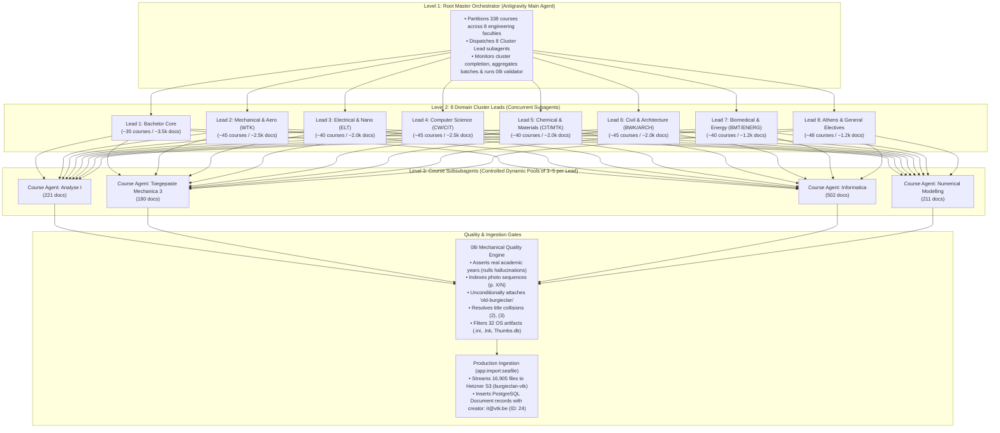

# Hierarchical AI Swarm Execution Plan: 338-Course Migration

This document is the master specification and execution plan for normalizing, validating, and importing all **16,905 academic documents across 338 engineering courses** (58 GB) from the legacy Seafile archive into the new Burgieclan platform.

---

## 1. System Architecture: 3-Level Multi-Agent Swarm



---

## 2. Cluster Workstream Breakdown

| Cluster Lead | Assigned Discipline & Faculty | Courses | Est. Docs | Special Domain Rules |
| :--- | :--- | :---: | :---: | :--- |
| **Lead 1: Bachelor Core** | 1st & 2nd Bachelor Math, Physics, Mechanics, Chemistry | 35 | ~3,500 | Differentiate TTT midterms, formularia, lecture notes |
| **Lead 2: Mechanical & Aero** | Werktuigkunde, Mechatronica, Lucht- & Ruimtevaart | 45 | ~2,500 | Photo-sequence scan sets, CAD/design exercises |
| **Lead 3: Electrical & Nano** | Elektrotechniek, Nanotechnologie, Embedded Systems | 40 | ~2,000 | Circuit schematics, lab reports, lab manuals |
| **Lead 4: Computer Science** | Computerwetenschappen, CW, AI, Methodiek Informatica | 45 | ~2,500 | MATLAB (`.m`), Python (`.py`), Java, C/C++ scripts |
| **Lead 5: Chemical & Materials** | Chemische technologie (CIT), Materiaalkunde (MTK) | 40 | ~2,000 | Chemical flowsheets, reaction kinetics, polymer labs |
| **Lead 6: Civil & Architecture** | Bouwkunde (BWK), Ingenieur-Architect (ARCH) | 45 | ~2,000 | Structural calculations, building design studios |
| **Lead 7: Biomedical & Energy** | Biomedische technologie (BMT), Energie | 40 | ~1,200 | Biomechanics datasets, power grid simulations |
| **Lead 8: Athens & Electives** | Athens courses, Economics, Management, Electives | 48 | ~1,200 | English-language tagging, corporate case studies |
| **TOTAL** | **All 8 Clusters** | **338** | **16,905** | **100% of Entire Legacy Archive** |

## 3. Step-by-Step Execution Phases

### Phase 0: Pre-Flight Verification Checklist
> [!IMPORTANT]
> All infrastructure prerequisites must be verified prior to launching the swarm.

1. **Production Database Live Assertions (`liv`)**:
   - Assert all 385 manifest courses exist in production:
     ```bash
     python3 -c "import json, subprocess; r=json.load(open('migration_data/manifest_final_standardized_validated.json')); ids=','.join(str(x['course_id']) for x in r if x.get('course_id')); sql=f'SELECT count(*) FROM course WHERE id IN ({ids});'; subprocess.run(['ssh', '-o', 'BatchMode=yes', 'it@liv', f'docker exec -i burgieclan-db psql -U burgieclan_db_user -d burgieclan_db -c \"{sql}\"'])"
     ```
     *(Asserts exact count $\rightarrow$ **385 / 385 verified**)*.
   - Assert all 6 document categories exist:
     ```bash
     ssh it@liv "docker exec -i burgieclan-db psql -U burgieclan_db_user -d burgieclan_db -c 'SELECT count(*) FROM document_category WHERE id BETWEEN 2 AND 7;'"
     ```
     *(Asserts exact count $\rightarrow$ **6 / 6 verified**)*.
   - `Document` entity columns: `author VARCHAR(255)`, `seafile_file_id VARCHAR(40)` with unique composite index `(seafile_file_id, course_id)`.
   - Migration Service Account: `it@vtk.be` (User ID: `24`, Roles: `["ROLE_USER", "ROLE_ADMIN"]`, locked).
2. **Staged Physical Files**:
   - All 16,820 valid documents present at `liv:/mnt/immich/burgieclan-staging/` (58 GB).
   - Extracted Page 1 text previews available on NFS (`manifest_with_content_previews.jsonl`).
3. **Storage & Tag Vocabulary**:
   - Hetzner S3 bucket `burgieclan-vtk` accessible via Flysystem.
   - `migration_data/tag_vocabulary.json` loaded with all 16 tag categories, toolings, and case-insensitive aliases.

---

## 4. Execution Stages

### STAGE 1 (Goal Run: Swarm Normalization & Production Dry-Run)

#### Phase 1: Payload Preparation & Smart Routing
1. Generate cluster definition manifests: `migration_data/clusters/cluster_{1..8}.json`.
2. Generate course-level input JSONs containing Page 1 text previews, paths, file sizes, and scan flags.
3. **Smart Worker Routing**:
   - **Blind Documents (7,187 docs with <30 chars text)**: Routed through deterministic regex normalization (eliminates hallucination risk, saves 50% LLM runtime).
   - **Rich Documents (9,629 docs with Page 1 previews)**: Batched in micro-chunks of 20–25 files for AI reasoning.

#### Phase 2: Hierarchical Swarm Execution
1. Master Orchestrator spawns **8 Cluster Lead Subagents** via `invoke_subagent`.
2. Each Cluster Lead dispatches **Course Subagents in dynamic worker pools of 3–5 concurrent courses**.
3. Each Course Subagent processes its documents in **20–25 document micro-chunks** with fresh context:
   - **Deep Path & Directory Breadcrumb Reasoning**: Evaluates the full directory hierarchy (e.g. `/2de bach/H08U5A/Cursus/Pre 2018 (Mark Huyse)/...`) alongside Page 1 text:
     - **Curriculum Eras & Boundary Years**: Resolves cohort years (`2011-2012`, `Pre 2018` $\rightarrow$ `2017 - 2018`, `Vanaf 2018-2019` $\rightarrow$ `2018 - 2019`).
     - **Parent Topics & Chapter Sub-titles**: Enriches generic filenames with topic breadcrumbs (e.g. `Boek Adams Calculus - Oplossingen Hoofdstuk 10 (Vectors and Coordinate Geometry)`).
     - **Misplaced File Detection**: Detects and reclassifies misplaced exams, summaries, midterms (TTTs), slides, and code.
     - **Strict Handwriting Reasoning**: Validates genuine student handwriting vs printed scans.
   - Emits standardized JSON array: `{ file_id, display_title, category_id, year, author, tags }`.
   - Atomic disk checkpointing: immediately saves `migration_data/batches/{course_code}.json`.
4. Cluster Leads aggregate completed course batches and report completion to Master.

#### Phase 3: Assembly & Mechanical Quality Gate (`08i`)
1. Aggregator merges all batch outputs into `migration_data/full_ai_normalized_output.json`.
2. Run [`scripts/migration/08i_merge_and_validate_ai_manifest.py`](file:///home/jasperve/Documents/VTK/IT/burgieclan/scripts/migration/08i_merge_and_validate_ai_manifest.py):
   - **Mechanical Year Verification**: Asserts `YYYY - YYYY` string appears literally in filename/path/page text; nulls hallucinations.
   - **Photo Sequence Formatting**: Formats multi-image sets as `[Parent Context] - [Folder] (p. X/N)`.
   - **Provenance Tag**: Injects `'old-burgieclan'` into 100% of records.
   - **Author Cleansing**: Rejects status markers `(Empty)`, `(Student)`, `(Oplossing Caro)`.
   - **Collision Disambiguation**: Appends `(2)`, `(3)` on duplicate per-course titles.
   - **Junk Filtering**: Excludes the 80 meme / non-coursework and OS junk artifacts (`.ini`, `Thumbs.db`, `.lnk`, `.bak`, `.cpgz`). Preserves simulation database files (`inductor2d.db`, `brushedDC.db`, `t28.db`).
3. Produces final verified manifest: `migration_data/manifest_final_standardized_validated.json` (**16,820 records**).

#### Phase 4: Production Backup & Container Staging Dry-Run
1. Create a pre-migration database & S3 snapshot on `liv`:
   ```bash
   ssh it@liv "cd /opt/burgieclan && docker compose -f docker-compose.prod.yml run --rm backend console app:backup"
   ```
2. Transfer `manifest_final_standardized_validated.json` to `liv:/mnt/immich/burgieclan-staging/manifest_final_for_import.jsonl`.
3. Execute dry run in throwaway container with staging volume mount:
   ```bash
   ssh it@liv "cd /opt/burgieclan && docker compose -f docker-compose.prod.yml run --rm \
     -v /mnt/immich/burgieclan-staging:/staging backend \
     console app:import:seafile \
       --manifest=/staging/manifest_final_for_import.jsonl \
       --staged-dir=/staging \
       --creator=it@vtk.be \
       --dry-run"
   ```
4. Assert:
   - Command exits with code `0`.
   - Dry-run inspects **all records emitted by `08i`** (`stats['output']` = 16,820 physical files) with **0 missing files**.
   - `--manifest.failures.jsonl` does not exist or has 0 rows.

---

### STAGE 2 (Final Live Execution: Canary & Production S3 Streaming)

#### Phase 5: Live Ingestion & S3 Streaming
1. **Canary Ingestion (Single Course - H01A0B Analyse I)**:
   ```bash
   ssh it@liv "cd /opt/burgieclan && docker compose -f docker-compose.prod.yml run --rm \
     -v /mnt/immich/burgieclan-staging:/staging backend \
     console app:import:seafile \
       --manifest=/staging/manifest_final_for_import.jsonl \
       --staged-dir=/staging \
       --creator=it@vtk.be \
       --course=H01A0B"
   ```
   *Eyeball the imported documents live in the browser at `https://burgieclan.vtk.be/courses/H01A0B`.*

2. **Full Ingestion Run inside a detached session (`screen`)**:
   ```bash
   ssh it@liv "cd /opt/burgieclan && screen -dmS seafile-import docker compose -f docker-compose.prod.yml run --rm \
     -v /mnt/immich/burgieclan-staging:/staging backend \
     console app:import:seafile \
       --manifest=/staging/manifest_final_for_import.jsonl \
       --staged-dir=/staging \
       --creator=it@vtk.be"
   ```
   *(Because the import is idempotent on `(seafile_file_id, course_id)`, it simply skips the canary course and imports the remaining courses).*

3. **Monitor Live Progress Anytime**:
   ```bash
   ssh -t it@liv "screen -r seafile-import"
   ```
   *(Detach safely anytime with `Ctrl+A` followed by `D`)*.

4. **Post-Ingestion Verification**:
   - Check failure log: `test ! -s /mnt/immich/burgieclan-staging/manifest_final_for_import.jsonl.failures.jsonl`
   - Database row count: `SELECT count(*) FROM document WHERE seafile_file_id IS NOT NULL;` $\rightarrow$ matches `08i` manifest output count (~16,820 documents).
   - Tag assignments: `SELECT count(*) FROM tag_document;` $\rightarrow$ 100% tagged with `old-burgieclan`.
   - Take post-migration backup: `docker compose -f docker-compose.prod.yml run --rm backend console app:backup`
5. Verify live course pages on `https://burgieclan.vtk.be`!
