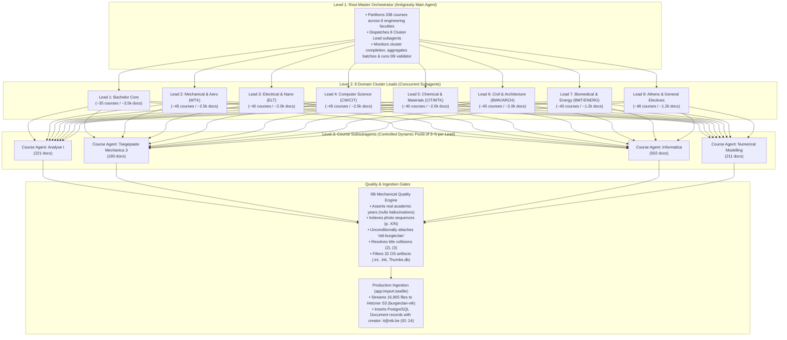

# Hierarchical AI Swarm Execution Plan: 338-Course Migration

This document is the master specification and execution plan for normalizing, validating, and importing all **16,905 academic documents across 338 engineering courses** (58 GB) from the legacy Seafile archive into the new Burgieclan platform.

---

## 1. System Architecture: 3-Level Multi-Agent Swarm



---

## 2. Cluster Workstream Breakdown

| Cluster Lead | Assigned Discipline & Faculty | Courses | Est. Docs | Special Domain Rules |
| :--- | :--- | :---: | :---: | :--- |
| **Lead 1: Bachelor Core** | 1st & 2nd Bachelor Math, Physics, Mechanics, Chemistry | 35 | ~3,500 | Differentiate TTT midterms, formularia, lecture notes |
| **Lead 2: Mechanical & Aero** | Werktuigkunde, Mechatronica, Lucht- & Ruimtevaart | 45 | ~2,500 | Photo-sequence scan sets, CAD/design exercises |
| **Lead 3: Electrical & Nano** | Elektrotechniek, Nanotechnologie, Embedded Systems | 40 | ~2,000 | Circuit schematics, lab reports, lab manuals |
| **Lead 4: Computer Science** | Computerwetenschappen, CW, AI, Methodiek Informatica | 45 | ~2,500 | MATLAB (`.m`), Python (`.py`), Java, C/C++ scripts |
| **Lead 5: Chemical & Materials** | Chemische technologie (CIT), Materiaalkunde (MTK) | 40 | ~2,000 | Chemical flowsheets, reaction kinetics, polymer labs |
| **Lead 6: Civil & Architecture** | Bouwkunde (BWK), Ingenieur-Architect (ARCH) | 45 | ~2,000 | Structural calculations, building design studios |
| **Lead 7: Biomedical & Energy** | Biomedische technologie (BMT), Energie | 40 | ~1,200 | Biomechanics datasets, power grid simulations |
| **Lead 8: Athens & Electives** | Athens courses, Economics, Management, Electives | 48 | ~1,200 | English-language tagging, corporate case studies |
| **TOTAL** | **All 8 Clusters** | **338** | **16,905** | **100% of Entire Legacy Archive** |

---

## 3. Step-by-Step Execution Phases

### Phase 0: Pre-Flight Verification Checklist
1. **Production Database (`liv`)**:
   - Total Courses in catalog: **781 courses**.
   - `Document` entity columns: `author VARCHAR(255)`, `seafile_file_id VARCHAR(40)` with unique composite index `(seafile_file_id, course_id)`.
   - Migration Service Account: `it@vtk.be` (User ID: `24`, Roles: `["ROLE_USER", "ROLE_ADMIN"]`, locked).
2. **Staged Physical Files**:
   - All 16,905 documents present at `liv:/mnt/immich/burgieclan-staging/` (58 GB).
   - Extracted Page 1 text previews available on NFS (`manifest_with_content_previews.jsonl`).
3. **Storage & Tag Vocabulary**:
   - Hetzner S3 bucket `burgieclan-vtk` accessible via Flysystem.
   - `migration_data/tag_vocabulary.json` loaded with all 16 tag categories, toolings, and `old-burgieclan`.

---

### Phase 1: Payload Preparation & Course Partitioning
1. Generate cluster definition manifests: `migration_data/clusters/cluster_{1..8}.json`.
2. Generate course-level input JSONs containing Page 1 text previews, paths, file sizes, and scan flags for each course.

---

### Phase 2: Hierarchical Swarm Execution
1. Master Orchestrator spawns **8 Cluster Lead Subagents** via `invoke_subagent`.
2. Each Cluster Lead dispatches **Course Subagents in dynamic worker pools of 3–5 concurrent courses**.
3. Each Course Subagent processes its documents in **20–25 document micro-chunks** with fresh context:
   - Emits standardized JSON array: `{ file_id, display_title, category_id, year, author, tags }`.
   - Atomic disk checkpointing: immediately saves `migration_data/batches/{course_code}.json`.
4. Cluster Leads aggregate completed course batches and report completion to Master.

---

### Phase 3: Assembly & Mechanical Quality Gate (`08i`)
1. Aggregator merges all batch outputs into `migration_data/full_ai_normalized_output.json`.
2. Run `scripts/migration/08i_merge_and_validate_ai_manifest.py`:
   - **Mechanical Year Verification**: Verifies `YYYY - YYYY` string appears literally in filename/path/page text; nulls hallucinations.
   - **Photo Sequence Formatting**: Formats multi-image sets as `[Folder Name] (p. X/N)`.
   - **Provenance Tag**: Injects `'old-burgieclan'` into 100% of records.
   - **Author Cleansing**: Rejects status markers `(Empty)`, `(Student)`, `(Oplossing Caro)`.
   - **Collision Disambiguation**: Appends `(2)`, `(3)` on duplicate per-course titles.
   - **Junk Filtering**: Drops the 32 useless OS artifacts (`.ini`, `Thumbs.db`, `.lnk`, `.bak`).
3. Produces final verified manifest: `migration_data/manifest_final_standardized_validated.json`.

---

### Phase 4: Staging & Dry-Run on Production (`liv`)
1. Transfer `manifest_final_standardized_validated.json` to `liv:/mnt/immich/burgieclan-staging/manifest_final_for_import.jsonl`.
2. Execute dry run in production container:
   ```bash
   ssh it@liv "docker exec -i burgieclan-backend /usr/local/bin/console app:import:seafile \
     /mnt/immich/burgieclan-staging/manifest_final_for_import.jsonl \
     --dry-run --creator=it@vtk.be"
   ```
3. Assert that all 16,905 physical files exist and can be read with 0 missing files.

---

### Phase 5: Final Production Ingestion & S3 Upload
1. Run live ingestion on `liv`:
   ```bash
   ssh it@liv "docker exec -i burgieclan-backend /usr/local/bin/console app:import:seafile \
     /mnt/immich/burgieclan-staging/manifest_final_for_import.jsonl \
     --creator=it@vtk.be"
   ```
2. Monitor real-time streaming progress to Hetzner S3 (`burgieclan-vtk`) and PostgreSQL insertions.
3. Verify database records:
   - `SELECT count(*) FROM document WHERE seafile_file_id IS NOT NULL;` -> **16,873 documents**.
   - `SELECT count(*) FROM tag_document;` -> **100% tagged with old-burgieclan**.
4. Confirm user-facing UI search in Burgieclan Next.js frontend!
