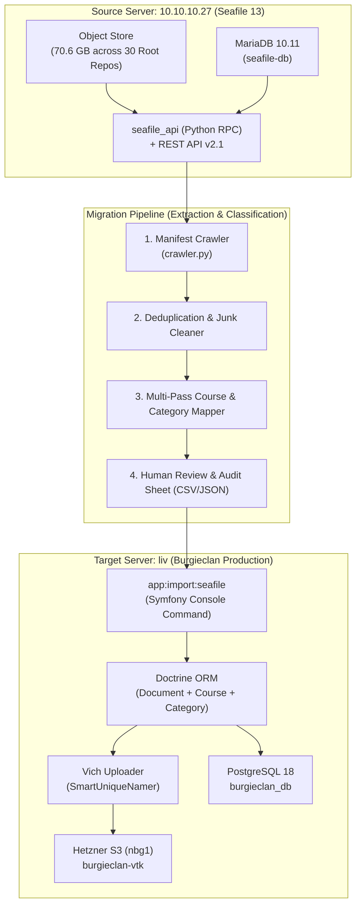
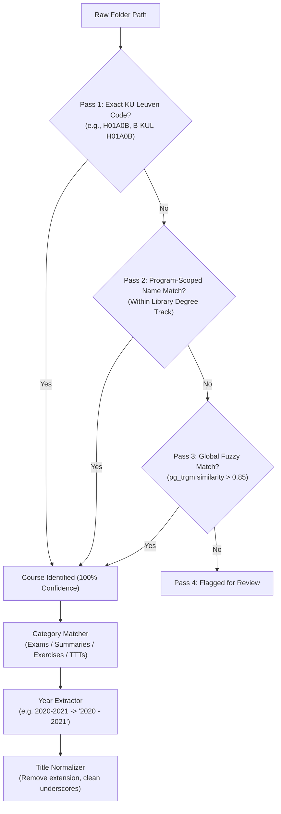

# Master Migration Plan: Seafile to Burgieclan

## 1. Executive Summary & Objectives

The goal of this project is to migrate all relevant academic materials (past exams, summaries, exercises, and TTTs) from the legacy **Seafile 13** repository (`10.10.10.27`) into the new **Burgieclan** production platform (`liv`), backed by **Hetzner Object Storage (S3)** and **PostgreSQL 18**.

### Key Principles
1. **Zero Raw SQL Hacks**: All document records will be created using Symfony's domain layer and Doctrine ORM (`Document` entities, Vich Uploader, Flysystem S3 adapter) to ensure proper naming, storage indexing, and entity lifecycles.
2. **High-Level Seafile Extraction**: Extraction will utilize Seafile's native Python API (`seafile_api`) and REST interfaces rather than reverse-engineering low-level storage chunks.
3. **Classification by Folder, Not by File**: Folders (~500 unique course directories) are classified deterministically; files inherit classification, ensuring speed, consistency, and auditable mappings.
4. **GDPR & Junk Quarantine**: Personal student libraries are strictly excluded; OS artifacts (`.DS_Store`, `Thumbs.db`), lock files, and zero-byte files are filtered out automatically.
5. **Full Reversibility**: A verified restore point via `app:backup` is taken before any data ingestion, allowing instant rollback via `app:restore`.

---

## 2. Infrastructure & System Overview



---

## 3. Scope & Inventory

### 3.1 Scope Definition
- **Owner**: `it@vtk.be`
- **Total Shared Libraries**: **30 Root Named Parent Libraries** (26 virtual sub-repos excluded).
- **Corpus Size**: **70.6 GB**
- **Estimated File Count**: **~23,625 files**

### 3.2 Target Document Categories
Every migrated document must map to one of the 4 standard categories in Burgieclan:

| Category ID | Name (NL) | Name (EN) | Detection Patterns |
| :---: | :--- | :--- | :--- |
| `2` | **Examens** | Exams | `examen`, `examens`, `tentamen`, `herkansing`, `exam`, `januari`, `juni`, `augustus`, `september` |
| `3` | **Samenvattingen** | Summaries | `samenvatting`, `samenvattingen`, `summary`, `notities`, `transparanten`, `cheatsheet`, `slides` |
| `4` | **Oefenzittingen** | Exercise Sessions | `oefenzittingen`, `oefeningen`, `werkcolleges`, `exercises`, `oplossingen`, `sessie`, `labo` |
| `5` | **TTT's** | TTT's | `ttt`, `tussentijdse toets`, `proefexamen`, `midterm`, `toets` |

---

## 4. Phase-by-Phase Execution Plan

### Phase 0: Pre-Migration Safeguards & Setup
1. **Take Baseline Snapshot**:
   ```bash
   # On liv
   docker compose -f docker-compose.prod.yml exec -T backend php bin/console app:backup
   ```
2. **Create Migration System User**:
   - Ensure a dedicated system user exists in Burgieclan (e.g. `it@vtk.be` with `ROLE_ADMIN` / `ROLE_USER`) to serve as the `creator` for all imported documents.
3. **Verify Disk & Network Capacities**:
   - Confirm temp scratch space on migration host and check bandwidth limits.

---

### Phase 1: Seafile Crawl & Raw Manifest Generation

Run a Python crawler script inside the `seafile` container on `10.10.10.27`:
- **Tool**: `scripts/migration/01_crawl_seafile.py`
- **Mechanism**: Calls `seafile_api.list_dir_by_path(repo_id, path)` recursively for all 30 parent libraries.
- **Data Captured per File**:
  ```json
  {
    "repo_id": "fce89d84-bd58-43b0-b962-a98230b49af0",
    "repo_name": "Ba - Algemene gemeenschappelijke basis",
    "path": "/Semester 1/H01A0B - Analyse I/Examen en TTT/Examens/Vanaf 2018-2019/Examen 2021-01-24 Oplossing.pdf",
    "filename": "Examen 2021-01-24 Oplossing.pdf",
    "extension": "pdf",
    "size_bytes": 1048576,
    "file_id": "4b825dc642cb6eb9a060e54b83...",
    "mtime": 1611500000,
    "sha256": "dbed8938c92a..."
  }
  ```

#### Filtering at Crawl Time:
- **Discard OS Noise**: `.DS_Store`, `Thumbs.db`, `desktop.ini`, `__MACOSX/`, `.Spotlight-V100`
- **Discard Lock/Temp Files**: `~$*.docx`, `*.tmp`, `*.crdownload`, `*.part`
- **Discard Zero-Byte Files**: `size_bytes == 0`
- **Discard Development Dumps**: `.git/`, `node_modules/`, `__pycache__/`

---

### Phase 2: Deduplication & Path Normalization

- **SHA-256 Deduplication**: Group files sharing identical content hashes.
  - If a file exists in multiple libraries (e.g. shared between Electrical and Mechanical), link it to the primary matching course and avoid duplicate S3 uploads.
- **Directory Grouping**: Extract the distinct folder paths to perform coarse-grained classification.

---

### Phase 3: Multi-Pass Deterministic Classification

Classification occurs in 4 distinct passes, prioritizing determinism:



#### 3.1 Course Matching Rules
1. **Pass 1: Exact Code Match (Regex)**
   - Pattern: `/\b([A-Z0-9]{6})\b/` or `/\b(H[0-9]{2}[A-Z0-9]{3})\b/`
   - Maps directly against `course.code` (which is unique in the database).
   - Expected accuracy: **~80-85% of all files**.
2. **Pass 2: Program-Scoped Match**
   - Match folder name against `course.name_nl` / `course.name_en` only within the courses linked to the library's `Program` (e.g. `Ba - Werktuigkunde`).
   - Prevents cross-discipline false matches.
3. **Pass 3: Fuzzy Match (pg_trgm)**
   - Trigram similarity threshold $\ge 0.85$.
4. **Pass 4: Human Review Queue**
   - Unresolved folders (e.g. "Random", "Varia", "Gidsen") flagged for manual mapping or omission.

#### 3.2 Category Matching Rules
- Scans path components from right to left:
  - Contains `examen`, `tentamen`, `exam` $\rightarrow$ `Examens` (ID 2)
  - Contains `samenvatting`, `summary`, `slides`, `notities` $\rightarrow$ `Samenvattingen` (ID 3)
  - Contains `oefening`, `oefenzitting`, `exercises`, `oplossing` $\rightarrow$ `Oefenzittingen` (ID 4)
  - Contains `ttt`, `tussentijdse` $\rightarrow$ `TTT's` (ID 5)
  - Fallback: `Samenvattingen` (ID 3) or review flag.

#### 3.3 Academic Year Extraction
- Pattern 1: `2018-2019`, `2021_2022`, `19-20` $\rightarrow$ Formatted to standard `"YYYY - YYYY"` (e.g., `"2021 - 2022"`).
- Pattern 2: Single year `2020` $\rightarrow$ Formatted to `"2020 - 2021"`.
- Pattern 3: Fallback from file modification timestamp:
  - If month $\ge 9$ (September–December) $\rightarrow$ Year is `Y - (Y+1)`.
  - If month $< 9$ (January–August) $\rightarrow$ Year is `(Y-1) - Y`.

#### 3.4 Clean Document Title Generation
- Strip extension (`.pdf`, `.docx`).
- Replace underscores and multiple dashes with spaces.
- Capitalize words cleanly (`Examen 2021 01 24 Oplossing`).

---

## 5. Phase 4: Review, Approval & Audit Sheet

Before executing any imports, the pipeline outputs:
1. `mapping_summary.csv`: Full breakdown of every folder $\rightarrow$ Course Code + Category + Year.
2. `unmapped_review.csv`: List of folders and files that could not be mapped with high confidence.

**Approval Gate**: You inspect and approve the mapping summary before the ingestion command is executed.

---

## 6. Phase 5: High-Level Symfony Ingestion Command

### 6.1 Command Signature
```bash
docker compose -f docker-compose.prod.yml exec -T backend php bin/console app:import:seafile \
    --manifest=/app/data/migration_manifest.jsonl \
    --source-host=10.10.10.27 \
    --batch-size=50 \
    --dry-run
```

### 6.2 Execution Logic
1. **Streaming Ingestion**:
   - For each entry in the approved manifest:
     - Streams file from Seafile API into a temporary local buffer `/tmp/import-stream-...`.
     - Instantiates `Document` entity with creator `it@vtk.be`.
     - Sets `$document->setCourse($course)`, `$document->setCategory($category)`, `$document->setYear($year)`.
     - Sets `$document->setName($cleanTitle)`, `$document->setAnonymous(true)`, `$document->setUnderReview(false)`.
     - Sets `$document->setFile(new File($tempPath))`.
     - Persists through `EntityManagerInterface`.
2. **Vich & S3 Processing**:
   - Vich Uploader generates the smart unique filename and uploads to Hetzner S3 bucket (`burgieclan-vtk`).
   - Automatically populates `file_size` and `file_name` in PostgreSQL.
3. **Batch Flushing & Memory Safety**:
   - Flushes every 50 documents: `$entityManager->flush(); $entityManager->clear();`.
   - Temporary file unlinked immediately in `finally` block.
4. **Idempotency**:
   - Checks if a document with the same course, category, year, and file hash already exists, allowing seamless resuming if interrupted.

---

## 7. Phase 6: Verification & Rollback Procedures

### 7.1 Verification Checklist
- Total documents created matches approved manifest count.
- Course document counts reflect expected distribution across all Bachelor and Master programs.
- Spot-check download links via Burgieclan web UI.
- Verify S3 storage stats in Hetzner console.

### 7.2 Rollback Protocol
If any issue is detected after migration:
```bash
# Instant rollback to pre-migration database state
docker compose -f docker-compose.prod.yml exec -T backend php bin/console app:restore --force
```

---

## 8. Summary Table of Migration Steps

| Step | Script / Command | Location | Output Artifact |
| :---: | :--- | :--- | :--- |
| **0** | `app:backup` | `liv` (Production) | Pre-migration S3 backup snapshot |
| **1** | `01_crawl_seafile.py` | `10.10.10.27` (Seafile) | `manifest_raw.jsonl` |
| **2** | `02_clean_and_dedup.py` | Local / Staging | `manifest_deduped.jsonl` |
| **3** | `03_classify_corpus.py` | Local / Staging | `manifest_classified.jsonl` + `review.csv` |
| **4** | Human Review & Signoff | User / IT Team | Approved manifest |
| **5** | `app:import:seafile` | `liv` (Production Backend) | Production DB rows + S3 Objects |
| **6** | Post-import `app:backup` | `liv` (Production) | Final post-migration S3 backup |
