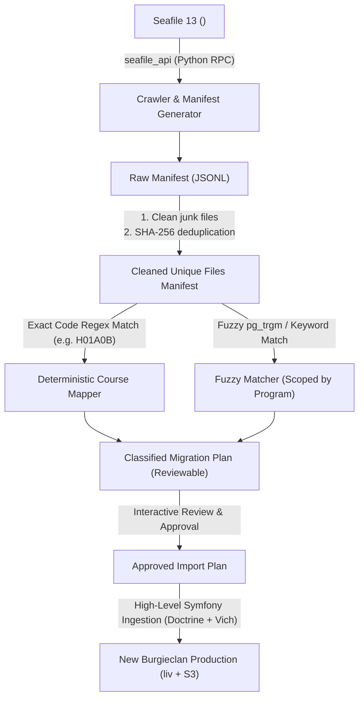

# Seafile to Burgieclan Migration: Background Knowledge & Research

This document compiles the architectural analysis, data schemas, API interfaces, and structural findings gathered from the live systems (**Seafile 13** on `<seafile-host>` and **Burgieclan Production** on `liv`).

---

## 1. High-Level Ingestion Principles

### 1.1 Why Raw SQL Insertion Is Prohibited
In the new Burgieclan architecture, a document is not just a row in PostgreSQL:
1. **Storage Mapping via Vich Uploader & Flysystem**:
   - In production, document files are stored in Hetzner S3 (`burgieclan-vtk` in Nuremberg `nbg1`).
   - Vich Uploader's `SmartUniqueNamer` generates collision-free file keys.
   - Flysystem streams binaries to S3 and registers the exact `file_size` and `file_name`.
2. **Doctrine Entity Lifecycle**:
   - `Document` extends `Node`, requiring a non-nullable `creator` relation (`User`).
   - Mandatory foreign keys to `Course` and `DocumentCategory`.
   - Formatted academic year (e.g., `"2024 - 2025"`).
   - Boolean flags: `under_review`, `anonymous`.
3. **High-Level Ingestion Service**:
   - Documents must be created through Symfony's domain layer (`EntityManagerInterface` + `Vich\UploaderBundle` file handling) or a dedicated console migration command (`app:import:seafile`).

```php
// Standard high-level document ingestion pattern
$document = new Document($migrationSystemUser);
$document->setName($cleanedTitle);
$document->setCourse($targetCourseEntity);
$document->setCategory($targetCategoryEntity);
$document->setYear($academicYear); // e.g. "2021 - 2022"
$document->setUnderReview(false);
$document->setAnonymous(true);
$document->setFile(new \Symfony\Component\HttpFoundation\File\File($localTempFile));

$entityManager->persist($document);
$entityManager->flush();
```

---

## 2. High-Level Seafile Extraction Interfaces

### 2.1 Seafile Architecture on `<seafile-host>`
- **Engine**: Seafile Server 13.0.25 (Dockerized, backed by MariaDB 10.11 & Redis).
- **Storage**: Chunks and blocks stored in content-addressed object storage (`/opt/seafile/shared/seafile/seafile-data/`).
- **Access Methods**:
  1. **Seafile Python API (`seafile_api` RPC)**:
     - Available inside the `seafile` container via Unix socket `/opt/seafile/seafile-server-13.0.25/runtime/seafile.sock`.
     - Supports recursive directory listing: `seafile_api.list_dir_by_path(repo_id, path)`.
     - Supports direct file metadata retrieval: `seafile_api.get_file_id_by_path(repo_id, path)`.
     - Supports reading commit logs and author details.
  2. **Seafile REST API v2.1 (`/api2/` and `/api/v2.1/`)**:
     - Endpoints:
       - `GET /api2/repos/{repo_id}/dir/?p=/path` (List folder contents)
       - `GET /api2/repos/{repo_id}/file/?p=/path` (Download file stream / URL)
       - `GET /api2/repos/{repo_id}/file/detail/?p=/path` (Metadata: mtime, size)
  3. **`seaf-fsck --export`**:
     - Built-in command to export full library trees to filesystem.

---

## 3. Source Data Analysis: Seafile Corpus

### 3.1 Scope of Shared Libraries
Analysis of `seafile-db` on `<seafile-host>` reveals:
- Total libraries owned by `it@vtk.be`: **56 libraries** (70.6 GB, ~23,625 files).
- **Root Parent Libraries**: **30 named libraries** (representing degree programs).
- **Virtual Sub-Repos (`VirtualRepo`)**: **26 unnamed libraries** (which are merely shared sub-folders of the 30 parent libraries).
- **GDPR Protection**: Excluding ~12,267 private student personal libraries (owner `*@student.kuleuven.be`).

### 3.2 Top Parent Libraries Overview

| Library Name | Size | Files | Degree Level |
| :--- | :---: | :---: | :--- |
| `Ba - Algemene gemeenschappelijke basis` | 10.0 GB | 3,383 | Bachelor (Common 1st/2nd yr) |
| `Ba - Architectuur` | 5.2 GB | 1,834 | Bachelor Architecture |
| `Ba - Werktuigkunde` | 4.4 GB | 1,750 | Bachelor Mechanical |
| `Ma - Electrical Engineering` | 3.8 GB | 949 | Master Electrical |
| `Ma - Mechanical Engineering` | 3.8 GB | 2,351 | Master Mechanical |
| `Ma - Energy` | 3.3 GB | 754 | Master Energy |
| `Ma - Chemical Engineering` | 3.1 GB | 238 | Master Chemical |
| `Ba - Elektrotechniek` | 2.6 GB | 980 | Bachelor Electrical |
| `Ma - Biomedical Engineering` | 2.5 GB | 412 | Master Biomedical |
| `Ba - Computerwetenschappen` | 2.1 GB | 1,047 | Bachelor CS |
| `Schakel - Werktuigkunde` | 1.9 GB | 718 | Bridging Mechanical |
| `Ma - Computer Science` | 1.9 GB | 1,274 | Master CS |
| `Ba - Bouwkunde` | 1.8 GB | 536 | Bachelor Civil |
| `Ma - Civil Engineering` | 1.6 GB | 535 | Master Civil |
| `Ba - Biomedische technologie` | 1.5 GB | 284 | Bachelor Biomedical |
| `Ma - Mobility and Supply Chain Engineering` | 1.5 GB | 343 | Master Mobility |
| `Ba - Chemische technologie` | 1.5 GB | 362 | Master Chemical |
| `Ma - Architectuur` | 1.4 GB | 519 | Master Architecture |
| `Ba - Materiaalkunde` | 1.3 GB | 339 | Bachelor Materials |
| `Ma - Nanoscience, -technology and -engineering` | 775.6 MB | 84 | Master Nano |
| `Ba - Bedrijfsbeheer` | 561.3 MB | 226 | Bachelor Minor |
| `Ma - Materials Engineering` | 507.7 MB | 161 | Master Materials |
| `Ma - Mathematical Engineering` | 467.6 MB | 62 | Master Math Eng |
| `Ma - Algemeen vormende onderdelen` | 424.7 MB | 139 | General Courses |
| `Schakel - Algemeen` | 312.1 MB | 168 | Bridging General |
| `Ba - Architectuur en omgeving` | 160.0 MB | 123 | Bachelor Arch |
| `ManaMa - Artificial Intelligence` | 65.7 MB | 19 | Master-after-Master AI |
| `Ba - Technologie van de levende systemen [OLD]` | 47.1 MB | 13 | Legacy Bachelor |

---

## 4. Seafile Folder Tree Hierarchy Patterns

Inspecting representative libraries (e.g. `Ba - Algemene basis`) demonstrates a consistent 4-level structure:

```
Library (e.g. "Ba - Algemene gemeenschappelijke basis")
 └── Level 1: Semester / Phase (e.g. "/Semester 1", "/Semester 2", "/2de bach")
      └── Level 2: Course Folder (e.g. "/Semester 1/H01A0B - Analyse I")
           └── Level 3: Category Folder (e.g. "Examens", "Samenvattingen", "Oefenzittingen", "TTT")
                └── Level 4: Year / Sub-topic (e.g. "Vanaf 2018-2019", "2021-2022")
                     └── Files (e.g. "Examen 2021-01-24 Oplossing.pdf")
```

---

## 5. Target Burgieclan Data Models & Entities

### 5.1 Document Categories in Production

| ID | Dutch (`name_nl`) | English (`name_en`) | Typical Seafile Folder Keywords |
| :---: | :--- | :--- | :--- |
| `2` | **Examens** | Exams | `examen`, `examens`, `tentamen`, `herkansing`, `exam` |
| `3` | **Samenvattingen** | Summaries | `samenvatting`, `summary`, `notities`, `cheatsheet`, `transparanten` |
| `4` | **Oefenzittingen** | Exercise Sessions | `oefenzittingen`, `oefeningen`, `werkcolleges`, `exercises`, `sessies` |
| `5` | **TTT's** | TTT's | `ttt`, `tussentijdse toets`, `proefexamen`, `midterm` |

### 5.2 Course Matching Model
- **Primary Key**: `id` (integer).
- **Authoritative Code**: `code` (string, 6 alphanumeric characters, e.g. `H01A0B`, `H01A2A`).
  - KU Leuven course codes are unique and directly present in ~80% of Seafile folder names.
- **Multilingual Names**: `name_nl`, `name_en`, `name` (indexed for pg_trgm fuzzy matching).
- **Programs & Modules**:
  - `Program`: 16 authoritative programs imported from KU Leuven onderwijsaanbod.
  - Scoping folder searches by the library's degree program (e.g. matching inside `Ba - Werktuigkunde` against courses in that program) eliminates false positives.

### 5.3 Document Metadata Constraints
- **Academic Year Format**: Regex `^\d{4} - \d{4}$` (e.g. `"2020 - 2021"`).
- **File Name Cleaning**:
  - Raw filename: `Examen_2020-08-17_Theorie_Blanco.pdf`
  - Clean title: `Examen 2020 08 17 Theorie Blanco`
- **Attribution**:
  - System migration bot / admin account (`it@vtk.be` user).
  - Flags: `anonymous = true`, `under_review = false`.

---

## 6. Filtering & Quality Control Rules

### 6.1 Unusable / Junk Files to Exclude
- OS Artifacts: `.DS_Store`, `Thumbs.db`, `desktop.ini`, `__MACOSX/`
- Temporary & Lock Files: `~$*.docx`, `*.tmp`, `*.crdownload`, `*.part`
- Empty Files: `size == 0 bytes`
- Source code build clutter: `.git/`, `node_modules/`, `.idea/`, `.vscode/`, `__pycache__/`

### 6.2 Deduplication Strategy
- Seafile stores chunks by SHA-1/SHA-256.
- Manifest generation must compute SHA-256 for each distinct file.
- When the same document exists across multiple libraries (e.g., shared between Civil and Mechanical), it should be mapped once per relevant course without re-uploading duplicate binaries to S3.

---

## 7. Migration Execution Architecture



---

## 8. Summary & Next Step

All prerequisite knowledge, schemas, and live API endpoints have been analyzed and verified.
Once this foundation is reviewed, the full migration plan can be structured around these verified components.
