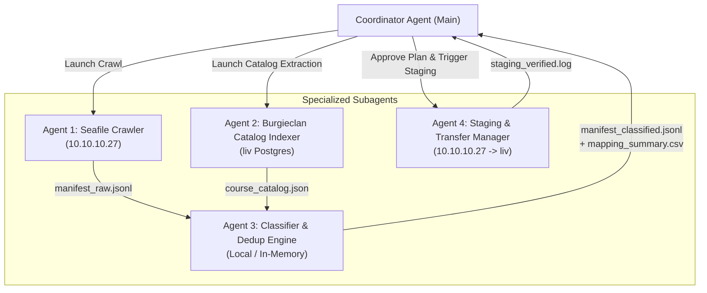

# Preprocessing Master Plan & Multi-Agent Architecture

## 1. Executive Summary & Objective

The goal of this preprocessing phase is to crawl the Seafile repository, build a cleaned and deduplicated manifest, classify all files to their target Burgieclan courses/categories, and stage the final corpus onto `liv:/mnt/immich/burgieclan-staging/` with zero risk to production.

---

## 2. Multi-Agent Team Architecture

Using specialized subagents allows us to parallelize work across both servers (`10.10.10.27` and `liv`) and keep massive file lists isolated from the main conversation context:

### Agent Roles & Responsibilities

| Subagent | Role | Machine | Responsibilities & Outputs |
| :--- | :--- | :--- | :--- |
| **1. Seafile Crawler** | Seafile Data Extractor | `10.10.10.27` | Runs Python script via `seafile_api` inside container; crawls all 30 parent libraries recursively; generates `manifest_raw.jsonl` with file sizes, mtimes, object IDs, and SHA-256 hashes. |
| **2. Catalog Indexer** | Burgieclan Schema Indexer | `liv` (Postgres) | Exports and structures all 733 courses (`id`, `code`, `name_nl`, `name_en`), 16 programs (module trees), categories (2, 3, 4, 5), and existing tags into `course_catalog.json`. |
| **3. Classification Engine** | Classifier & Deduplicator | Local | Deduplicates across degree programs by SHA-256; runs the multi-pass course/category/year matcher; outputs `manifest_classified.jsonl`, `mapping_summary.csv`, and `unmapped_review.csv`. |
| **4. Staging Coordinator** | File Transfer & Integrity | `10.10.10.27` $\rightarrow$ `liv` | Sets up `/mnt/immich/burgieclan-staging/`; streams cleaned unique files from Seafile to `liv`; verifies SHA-256 checksums on completion. |

---

## 3. Preprocessing Execution Phases

### Phase 1: Parallel Crawl & Catalog Indexing
- **Step 1.1**: Agent 1 runs `scripts/migration/01_crawl_seafile.py` on `10.10.10.27` across all 30 root libraries.
  - Excludes OS noise (`.DS_Store`, `Thumbs.db`), lock files (`~$*.docx`), empty files (`0 bytes`).
  - Output: `data/migration/manifest_raw.jsonl`
- **Step 1.2**: Agent 2 queries PostgreSQL on `liv` for all courses, programs, and categories.
  - Output: `data/migration/course_catalog.json`

### Phase 2: Deduplication & Multi-Pass Classification
- **Step 2.1**: Agent 3 processes `manifest_raw.jsonl`:
  - Builds a SHA-256 hash map to collapse duplicate files across libraries.
  - Extracts distinct folder paths (~500 unique course directories).
- **Step 2.2**: Classification Passes:
  - **Pass 1 (Deterministic Code Regex)**: Matches 6-char KU Leuven codes (e.g. `H01A0B`) $\rightarrow$ ~80-85% hit rate.
  - **Pass 2 (Program-Scoped Name Match)**: Matches directory names against courses within the library's degree program (e.g. `Ba - Werktuigkunde`).
  - **Pass 3 (Fuzzy pg_trgm Match)**: High-similarity matching ($\ge 0.85$).
  - **Pass 4 (Category & Year Normalization)**: Categorizes into `Examens` (2), `Samenvattingen` (3), `Oefenzittingen` (4), `TTT's` (5); normalizes year format to `"YYYY - YYYY"`.
- **Step 2.3**: Produces Review Artifacts:
  - `data/migration/mapping_summary.csv`
  - `data/migration/unmapped_review.csv`

### Phase 3: Human Review & Approval
- You inspect `mapping_summary.csv` and review any flagged edge cases.
- Any manual overrides are applied to `data/migration/overrides.json`.

### Phase 4: Staging Corpus onto `liv` (`/mnt/immich/burgieclan-staging/`)
- **Step 4.1**: Agent 4 creates `/mnt/immich/burgieclan-staging/` on `liv` (9.1 TB free space).
- **Step 4.2**: Streams the cleaned, deduplicated files from `10.10.10.27` to `/mnt/immich/burgieclan-staging/`.
- **Step 4.3**: Verifies SHA-256 checksums of all staged files.

---

## 4. Why This Preprocessing Architecture Is Optimal

1. **Zero Production Risk**: No writes to PostgreSQL or live S3 buckets occur during preprocessing. Everything is staged and validated beforehand.
2. **Speed & Efficiency**: By deduplicating before staging, we minimize network transfer and storage.
3. **Local Ingestion Ready**: Once files sit in `/mnt/immich/burgieclan-staging/`, the final `app:import:seafile` ingestion runs 100% locally on `liv`, eliminating network latency or Seafile RPC timeouts during the Symfony/Doctrine database upload.
