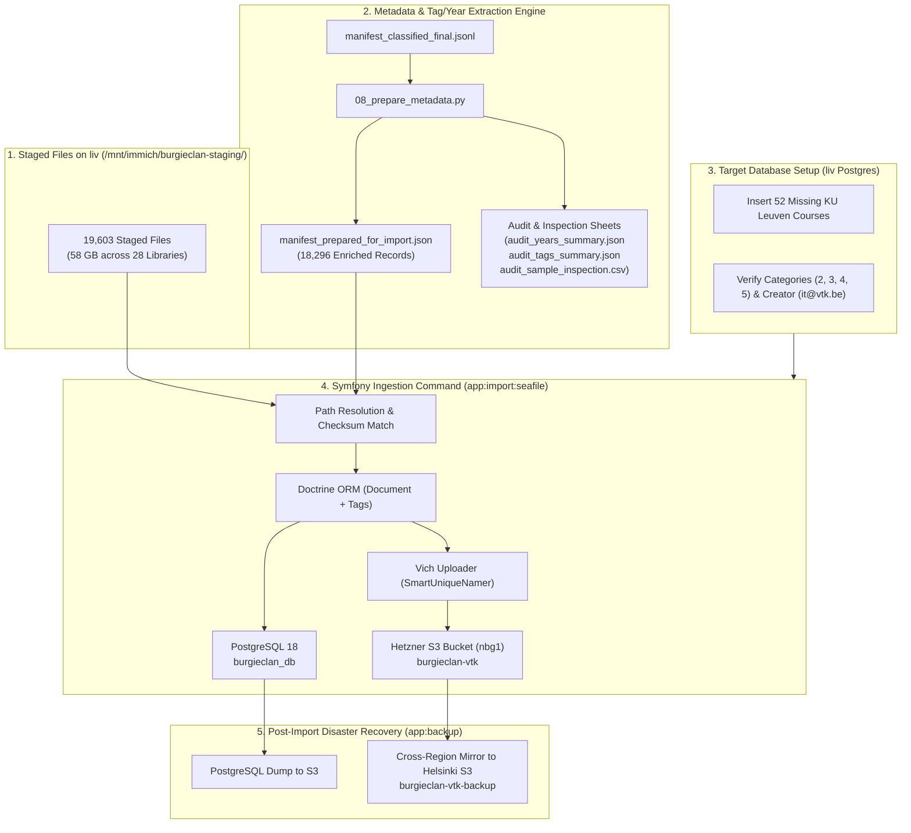

# Step 8 Execution Plan: Metadata Preparation, Database Setup & Symfony Ingestion

This document is the dedicated, self-contained master plan for **Step 8 (Metadata Preparation, Database Setup, Pilot Testing, and Full Production Ingestion)** of the **18,296 classified Seafile documents (58 GB)** from `liv:/mnt/immich/burgieclan-staging/` into **Burgieclan Production (PostgreSQL 18 + Hetzner S3)**.

---

## 1. Architecture & Data Flow



---

## 2. Granular Sub-Steps Breakdown

### Sub-Step 8.1: Metadata, Year, Tag & Title Extraction
- **Objective**: Build a complete, validated JSON manifest specifying the exact target metadata for every single file before any database operation.
- **Script**: `scripts/migration/08_prepare_metadata.py`
- **Inputs**:
  - `migration_data/manifest_classified_final.jsonl` (18,296 approved files)
  - `migration_data/course_catalog.json` (authoritative course list)
- **Extracted Attributes**:
  - **Academic Year**: Normalized to `YYYY - YYYY` format.
    - *Detection sources*: 4-digit ranges (`2023-2024`), 2-digit ranges (`23-24`), embedded dates (`2019-06-15`, `190617`), EU dates (`15-06-2019`), session-context years (Jan/June exam in 2021 $\rightarrow$ `2020 - 2021`), and file mtimes.
  - **Category ID**: Strict mapping to Burgieclan `document_category` foreign keys:
    - `2`: **Examens** (Exams, exam questions, past papers, resits)
    - `3`: **Samenvattingen** (Summaries, lecture notes, slides, cheatsheets, formularia)
    - `4`: **Oefenzittingen** (Exercise sessions, solutions, homework, code, lab, reports, projects)
    - `5`: **TTT's** (Midterms, progress tests, mock exams)
  - **Multi-Dimensional Tags**:
    - *Sessions*: `Januari`, `Juni`, `Augustus/September`, `Tussentijds`
    - *Nature*: `Oplossing`, `Theorie`, `Oefeningen`, `Formularium`, `Lesnotities`, `Slides`, `Labo & Code`, `Verslag / Project`, `Examenvragen`
    - *Sections*: `Deel 1`, `Deel 2`, `Deel 3`
    - *Language*: `English`
    - *Professors*: `Prof. [Name]`
  - **Clean Display Title**: Human-readable title without course code duplicates, underscores, or ugly file extensions.
- **Outputs**:
  - `migration_data/manifest_prepared_for_import.json`
  - `migration_data/manifest_prepared_for_import.jsonl`
- **Status**: ✅ **COMPLETED**

---

### Sub-Step 8.2: Quality Audit & Inspection Reports
- **Objective**: Produce aggregate statistics and representative sample sheets for human review.
- **Outputs**:
  - `migration_data/audit_years_summary.json`: Year breakdown across the corpus.
  - `migration_data/audit_tags_summary.json`: Frequency of all detected tags.
  - `migration_data/audit_sample_inspection.csv`: 100 evenly distributed sample rows across all courses and categories.
- **Key Metrics**:
  - **Total Documents**: 18,296
  - **Mapped Courses**: 389 distinct KU Leuven courses
  - **Tagged Documents**: 13,107 (71.6% coverage)
  - **Categories**: Oefenzittingen (8,025 / 43.9%), Samenvattingen (7,307 / 39.9%), Examens (2,843 / 15.5%), TTT's (121 / 0.7%)
- **Status**: ✅ **COMPLETED**

---

### Sub-Step 8.3: Production Database Setup on `liv`
- **Objective**: Ensure all foreign key targets (courses, categories, user) exist in production PostgreSQL before initiating file imports.
- **Script**: `scripts/migration/08c_setup_database_prerequisites.py`
- **Target Host**: `liv` (PostgreSQL container: `burgieclan-db`)
- **Operations**:
  1. Insert **52 missing KU Leuven courses** identified in `missing_courses_to_add.json` with official titles (e.g. `H01F2A`, `H08U4A`, `H06A1A`, `H04V3A`, `H0H08A`, etc.).
  2. Verify that `document_category` contains active IDs `2`, `3`, `4`, `5`.
  3. Ensure system user `it@vtk.be` exists in the `user` table to serve as document creator.
- **Validation**:
  - `SELECT COUNT(*) FROM course;` increases from 733 to 785.
  - 0 missing foreign keys when importing.
- **Status**: ⏳ **PENDING**

---

### Sub-Step 8.4: Staged File Path Resolution & Checksum Verification
- **Objective**: Verify that 100% of the 18,296 records in `manifest_prepared_for_import.json` correspond to an existing file in `/mnt/immich/burgieclan-staging/`.
- **Script**: `scripts/migration/08d_verify_staged_paths.py`
- **Target Host**: `liv`
- **Operations**:
  1. For each record, construct the expected staged path: `/mnt/immich/burgieclan-staging/<repo_name>/<relative_path>`.
  2. Verify file existence and match size against manifest.
  3. Build an indexed fast-lookup map for the Symfony ingestion command.
- **Validation**:
  - 100% (18,296 / 18,296) staged files verified on `liv`.
- **Status**: ⏳ **PENDING**

---

### Sub-Step 8.5: Pilot Ingestion Test & UI Smoke Test
- **Objective**: Verify end-to-end ingestion on a controlled subset (1 course, ~50 files) in production.
- **Scope**: Course `H01A0B - Analyse, deel 1` (Exams, Summaries, Exercises).
- **Target Command**:
  ```bash
  docker compose -f docker-compose.prod.yml exec -T backend php bin/console app:import:seafile \
      --course=H01A0B \
      --limit=50 \
      --dry-run
  
  docker compose -f docker-compose.prod.yml exec -T backend php bin/console app:import:seafile \
      --course=H01A0B \
      --limit=50
  ```
- **Verification Checkpoints**:
  1. **PostgreSQL**: Query `SELECT * FROM document WHERE course_id = (SELECT id FROM course WHERE code = 'H01A0B');` — verify names, categories, years, anonymous flag (`true`), under_review (`false`).
  2. **Tags**: Query `document_tag` — verify tags (`Oplossing`, `Theorie`, `Deel 1`, `Januari`, etc.) are linked.
  3. **Hetzner S3**: Verify binary objects are uploaded to `burgieclan-vtk` with valid mime types and sizes.
  4. **Frontend UI Smoke Test**: Open course page in browser, view documents list, search by tag, download PDF, and verify integrity.
- **Status**: ⏳ **PENDING**

---

### Sub-Step 8.6: Full Symfony Batch Ingestion (`app:import:seafile`)
- **Objective**: Ingest all 18,296 documents into production using Symfony's domain layer and Vich Uploader.
- **Command**:
  ```bash
  docker compose -f docker-compose.prod.yml exec -T backend php bin/console app:import:seafile \
      --manifest=/mnt/immich/burgieclan-staging/manifest_prepared_for_import.json \
      --staged-dir=/mnt/immich/burgieclan-staging/ \
      --batch-size=50
  ```
- **Architecture Highlights**:
  - **Memory Safety**: Doctrine `$em->flush(); $em->clear();` every 50 entities prevents PHP heap exhaustion.
  - **Streaming Uploads**: Files stream directly from `/mnt/immich/burgieclan-staging/` through Flysystem to Hetzner S3.
  - **Idempotency**: Skips any document already present by `(course, category, year, original_filename/file_size)`.
  - **Real-time Progress Bar**: Displays throughput (docs/sec), percentage, elapsed time, and ETA.
- **Validation**:
  - Database count: `SELECT COUNT(*) FROM document;` matches expected count (47 existing + 18,296 imported).
  - S3 bucket count and storage volume match manifest.
- **Status**: ⏳ **PENDING**

---

### Sub-Step 8.7: Post-Import Disaster Recovery Backup (`app:backup`)
- **Objective**: Create a verifiable snapshot immediately following migration completion.
- **Command**:
  ```bash
  docker compose -f docker-compose.prod.yml exec -T backend php bin/console app:backup
  ```
- **Operations**:
  1. Full PostgreSQL database dump uploaded to S3.
  2. Cross-region copy of all newly created S3 document objects from Nuremberg (`burgieclan-vtk`) to Helsinki (`burgieclan-vtk-backup`).
  3. Generate cryptographic SHA-256 backup manifest.
- **Cleanup**:
  - Remove temporary staging folder `/mnt/immich/burgieclan-staging/` after backup verification.
- **Status**: ⏳ **PENDING**

---

## 3. Entity Field Mapping Reference

| Burgieclan Property | Entity / Type | Source in `manifest_prepared_for_import.json` | Example Value |
| :--- | :--- | :--- | :--- |
| `name` | `string(255)` | `display_title` | `"Examen 2017 06 19 (Oplossing) (deel 1)"` |
| `course` | `Course` (FK) | `course_code` $\rightarrow$ `Course.id` | `H01G7A` |
| `category` | `DocumentCategory` (FK) | `category_id` | `2` (Examens) |
| `year` | `string(11)` | `year` | `"2016 - 2017"` |
| `tags` | `Collection<Tag>` | `tags` (array of strings) | `["Oplossing", "Juni", "Deel 1"]` |
| `creator` | `User` (FK) | Default system user | `it@vtk.be` |
| `under_review` | `boolean` | Hardcoded `false` | `false` |
| `anonymous` | `boolean` | Hardcoded `true` | `true` |
| `file` | `Vich\UploadableField` | Staged file path on NFS | `/mnt/immich/burgieclan-staging/...` |

---

## 4. Sub-Step Tracking & Execution Checklist

- [x] **8.1** Enrich manifest with academic years, rich tags, clean titles (`manifest_prepared_for_import.json`)
- [x] **8.2** Produce and review quality audit reports (`audit_sample_inspection.csv`)
- [ ] **8.3** Insert 52 missing courses & verify category taxonomy on `liv`
- [ ] **8.4** Verify 100% path resolution on `liv:/mnt/immich/burgieclan-staging/`
- [ ] **8.5** Execute pilot batch test for course `H01A0B` (50 files) and verify in UI
- [ ] **8.6** Execute full Symfony batch ingestion (`app:import:seafile`)
- [ ] **8.7** Run post-migration backup snapshot (`app:backup`) and verify Helsinki mirror
