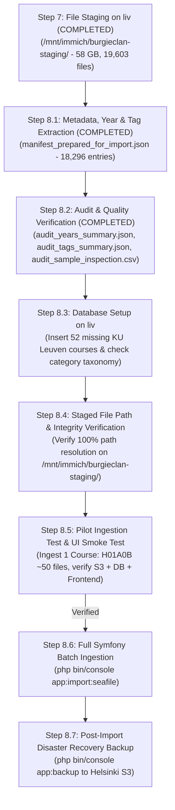

# Master Step-by-Step Migration Execution Plan (Steps 7–9)

This document details the exact execution plan for **Staging, Metadata Preparation, Database Setup, Pilot Testing, Full Symfony Ingestion, and Post-Migration Backup** for all **18,296 classified Seafile documents (58 GB)**.

---

## 1. Status & Prerequisites Summary

- **Audited Manifest**: `migration_data/manifest_prepared_for_import.json` contains **18,296 enriched documents**.
- **Staged Storage**: `liv:/mnt/immich/burgieclan-staging/` contains all **19,603 staged files (58 GB)**.
- **Target Database & S3**: PostgreSQL 18 on `liv` and Hetzner S3 bucket `burgieclan-vtk` in Nuremberg (`nbg1`).
- **Post-Migration Backup Target**: Hetzner S3 bucket `burgieclan-vtk-backup` in Helsinki (`hel1`).

---

## 2. Granular Step-by-Step Execution Protocol (Steps 7–9)



---

### Step 7: File Staging on liv (Status: ✅ COMPLETED)

- **Target Location**: `liv:/mnt/immich/burgieclan-staging/`
- **Results**: 19,603 files (58 GB) across all 28 non-empty libraries successfully staged overnight.

---

### Step 8.1: Metadata, Academic Year & Tag Enrichment (Status: ✅ COMPLETED)

- **Script**: `scripts/migration/08_prepare_metadata.py`
- **Output Files**:
  - `migration_data/manifest_prepared_for_import.json` (Full enriched JSON)
  - `migration_data/manifest_prepared_for_import.jsonl` (Streamable JSONL)
- **Extracted Attributes**:
  - **Academic Year**: `YYYY - YYYY` format parsed from filenames, date strings (`YYYY-MM-DD`, `YYMMDD`, `DD-MM-YYYY`), year ranges (`2023-2024`, `23-24`), and session context.
  - **Standard Category ID**: Foreign key mapped to Burgieclan `document_category` (2: Examens, 3: Samenvattingen, 4: Oefenzittingen, 5: TTT's).
  - **Rich Multi-Dimensional Tags**:
    - *Sessions*: `Januari`, `Juni`, `Augustus/September`, `Tussentijds`
    - *Nature*: `Oplossing`, `Theorie`, `Oefeningen`, `Formularium`, `Lesnotities`, `Slides`, `Labo & Code`, `Verslag / Project`, `Examenvragen`
    - *Sections*: `Deel 1`, `Deel 2`, `Deel 3`
    - *Language*: `English`
    - *Professors*: `Prof. [Surname]`

---

### Step 8.2: Audit Reports & Verification (Status: ✅ COMPLETED)

- **Audit Outputs**:
  - `migration_data/audit_years_summary.json`: Breakdown of all academic years and confidence levels.
  - `migration_data/audit_tags_summary.json`: Top tags and frequency statistics.
  - `migration_data/audit_sample_inspection.csv`: 100 representative rows across categories and courses for human review.
- **Key Statistics**:
  - **Total Documents**: 18,296
  - **Unique Courses**: 389
  - **Documents with Tags**: 13,107 (71.6%)
  - **Unique Tags Identified**: 24

---

### Step 8.3: Production Database Setup on liv (Status: ⏳ PENDING)

- **Target Host**: `liv` (Production PostgreSQL)
- **Script**: `scripts/migration/08c_setup_database_prerequisites.py`
- **Operations**:
  1. Insert 52 missing KU Leuven courses (from `missing_courses_to_add.json`).
  2. Verify creator user `it@vtk.be` exists.
  3. Validate category IDs (2, 3, 4, 5).

---

### Step 8.4: Staged File Path Resolution & Verification (Status: ⏳ PENDING)

- **Target Host**: `liv`
- **Script**: `scripts/migration/08d_verify_staged_paths.py`
- **Operations**:
  1. Iterate through `manifest_prepared_for_import.json` and verify that the corresponding file exists on `/mnt/immich/burgieclan-staging/<repo_name>/...`.
  2. Confirm 100% file path resolution prior to launching database insertion.

---

### Step 8.5: Pilot Ingestion Test & UI Smoke Test (Status: ⏳ PENDING)

- **Target Host**: `liv` (Production Backend Container)
- **Command**: `php bin/console app:import:seafile --course=H01A0B --limit=50`
- **Verifications**:
  1. Inspect PostgreSQL rows: Course `H01A0B`, category, year, tags, creator.
  2. Inspect S3 bucket `burgieclan-vtk` in Nuremberg: binary files present and readable.
  3. Smoke test UI & API: check document listing, metadata display, and PDF download.

---

### Step 8.6: Full Symfony Batch Ingestion (Status: ⏳ PENDING)

- **Target Host**: `liv` (Production Backend Container)
- **Command**:
  ```bash
  docker compose -f docker-compose.prod.yml exec -T backend php bin/console app:import:seafile \
      --manifest=/mnt/immich/burgieclan-staging/manifest_prepared_for_import.json \
      --staged-dir=/mnt/immich/burgieclan-staging/ \
      --batch-size=50
  ```
- **Execution Details**:
  - Memory-safe Doctrine flushes every 50 records (`$em->flush(); $em->clear()`).
  - Flysystem streaming to S3.
  - Idempotent: skips existing documents.

---

### Step 8.7: Post-Migration Backup & Cleanup (Status: ⏳ PENDING)

- **Target Host**: `liv`
- **Command**: `php bin/console app:backup`
- **Operations**:
  1. Full PostgreSQL database dump uploaded to S3.
  2. Cross-region synchronization to Helsinki backup bucket (`burgieclan-vtk-backup`).
  3. Verifiable SHA-256 backup manifest generated.
