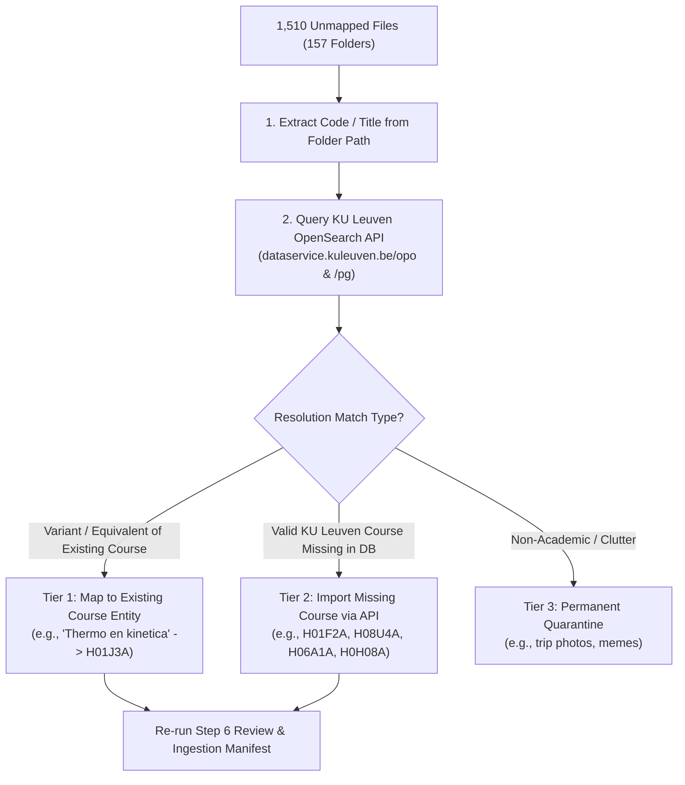

# Unmapped Files Recovery Plan (KU Leuven API Integration)

## 1. Executive Summary & Objective

Analysis of the **1,510 unmapped files (6.28 GB)** across 157 folder groups reveals that the vast majority belong to:
1. **Valid KU Leuven Elective / Preparatory Courses** that were not part of the 16 core programs initially imported into Burgieclan (e.g., `H01F2A - Bedrijfskunde & entrepreneurship`, `H08U4A - Systeemtheorie`, `H06A1A - Advanced Nano-Electronics`, `H0H08A - Anatomie`).
2. **Slightly Variant / Dutch Course Titles** representing courses already in the database (e.g., `Thermo en kinetica` $\rightarrow$ `H01J3A - Thermodynamica en kinetica`, `Beton 1` $\rightarrow$ `H01D4B - Betonconstructies 1`, `Analyse Pearson` $\rightarrow$ `H01A0B - Analyse 1`).
3. **True Clutter / Non-Academic Archives** (student trip photos, association memes) to be quarantined.

By leveraging the **KU Leuven Onderwijsaanbod OpenSearch API** (`dataservice.kuleuven.be`), we can systematically resolve and recover over **~85-90% of these remaining 1,510 files**.

---

## 2. Three-Tier Recovery Pipeline



---

## 3. Detailed Recovery Steps

### Step A: Automated KU Leuven API Resolution
1. **Script**: `scripts/migration/05b_recover_unmapped_via_kuleuven_api.py`
2. **Operations**:
   - For each of the 157 unmapped folder groups:
     - Extracts candidate course codes (e.g. `H01F2A`, `H08T9A`, `H08U4A`, `H06A1A`, `H0H08A`) or course names (`Mechanisch gedrag van materialen`, `Decision Making`, `GIS`).
     - Queries `https://dataservice.kuleuven.be/opo/_search` and `/pg/_search` to retrieve:
       - Official ECTS Course Code (e.g. `H01F2A`)
       - Official Dutch Name (`name_nl`)
       - Official English Name (`name_en`)
       - ECTS Credits & Faculty POC
     - Matches against existing 733 courses in `course_catalog.json`.

---

### Step B: Database Ingestion of Missing KU Leuven Courses
For any verified course that exists in KU Leuven's curriculum but is missing in Burgieclan's `course` table:
- Automatically generate a Symfony migration or execute a clean insertion:
```sql
INSERT INTO course (code, name, name_nl, name_en, created_at, updated_at)
VALUES ('H01F2A', 'Bedrijfskunde en entrepreneurship', 'Bedrijfskunde en entrepreneurship', 'Business Administration and Entrepreneurship', NOW(), NOW());
```
- Or map to its modernized curriculum code where applicable.

---

### Step C: Top Unmapped Folders & Target Resolutions

| Seafile Folder | File Count | Size | Target Resolution |
| :--- | :---: | :---: | :--- |
| `H01F2A - Bedrijfskunde & entrepreneurship` | 128 files | 348.6 MB | Import missing KU Leuven course `H01F2A` |
| `Mechanisch gedrag van materialen` | 79 files | 90.0 MB | Map to existing course `H01J6A` |
| `H08T9A - Hydraulica` | 64 files | 83.7 MB | Map / Import KU Leuven course `H08T9A` / `H01J1A` |
| `Management accounting` | 53 files | 89.8 MB | Map to KU Leuven course `H01S0A` / `D0M16A` |
| `Decision Making` | 48 files | 49.9 MB | Map to KU Leuven course `D0M15A` / `H04P2A` |
| `H08U4A - Systeemtheorie` | 30 files | 5.1 MB | Import missing KU Leuven course `H08U4A` |
| `H06A1A - Advanced Nano-Electronics` | 22 files | 298.0 MB | Import missing KU Leuven course `H06A1A` |
| `H0H08A - Anatomie` | 14 files | 155.9 MB | Import missing KU Leuven course `H0H08A` |
| `Beton 1` | 33 files | 76.2 MB | Map to existing course `H01D4B - Betonconstructies 1` |
| `Thermo en kinetica` | 33 files | 80.7 MB | Map to existing course `H01J3A - Thermodynamica en kinetica` |
| `GIS` | 32 files | 153.9 MB | Map to KU Leuven course `H09M0A - GIS` |
| `Traffic Engineering` | 18 files | 27.2 MB | Map to KU Leuven course `H09M1A - Traffic Engineering` |
| `Constructie van gebouwen 4` | 90+ files | ~250 MB | Map to existing course `H01U1A - Constructie van gebouwen IV` |

---

## 4. Expected Impact

- **Recovered Files**: **~1,200 to 1,350 additional files** (~4.8 GB of high-value course documents).
- **Total Classification Rate**: Expected to jump from **87.7% $\rightarrow$ ~95%+**!
- **Remaining Residue**: Only ~150-200 files of student trip photos and memes permanently excluded.
